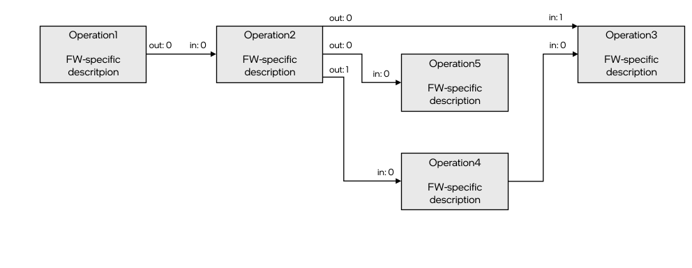

# Model Optimizer Extensibility {#openvino_docs_MO_DG_prepare_model_customize_model_optimizer_Customize_Model_Optimizer}

@sphinxdirective

.. toctree::
   :maxdepth: 1
   :hidden:

   openvino_docs_MO_DG_prepare_model_customize_model_optimizer_Extending_Model_Optimizer_With_Caffe_Python_Layers
   openvino_docs_MO_DG_prepare_model_customize_model_optimizer_Model_Optimizer_Extensions

@endsphinxdirective

<a name="model-optimizer-extensibility"></a>Model Optimizer extensibility mechanism enables support of new operations and custom transformations to generate the optimized intermediate representation (IR) as described in the
[Deep Learning Network Intermediate Representation and Operation Sets in OpenVINO™](../../IR_and_opsets.md). This
mechanism is a core part of Model Optimizer, as a huge set of examples showing how to add custom logic to support your model.

There are several cases when the customization is needed:

* A model contains operation(s) not known for the Model Optimizer, but these operation(s) could be expressed as a
combination of supported operations. In this case, a custom transformation should be implemented to replace unsupported
operation(s) with supported ones.
* A model contains a sub-graph of operations that can be replaced with a smaller number of operations to get better
performance. This example corresponds to so-called *fusing transformations*, for example, replacing a sub-graph performing the calculation \f$x / (1.0 + e^{-(beta * x)})\f$ with a single operation of type
[Swish](../../../ops/activation/Swish_4.md).
* A model contains a custom framework operation (the operation that is not a part of an official operation set of the
framework) that was developed using the framework extensibility mechanism. In this case, Model Optimizer should know
how to handle the operation and generate a corresponding section in an IR for it.

It is necessary to figure out how Model Optimizer represents a model in a memory and converts it to an IR before
going into details of the Model Optimizer extensibility mechanism.

> **NOTE**: All paths in this article are provided relatively to the Model Optimizer installation directory if not
> stated otherwise.

## Model Representation in Memory <a name="model-representation-in-memory"></a>
The model can be represented as a directed graph, where nodes are operations and edges correspond to data passing from a
producer operation (node) to a consumer operation (node).

Model Optimizer uses Python class `mo.graph.graph.Graph` instance to represent the computation graph in memory during
the model conversion. This class is inherited from the `networkx.MultiDiGraph` class of the standard `networkx` Python
library. It provides many convenient methods to traverse and modify the graph. For the examples, refer to the `mo/graph/graph.py` file.

Model Optimizer keeps all necessary information about the operation in node attributes. Model Optimizer uses the `mo.graph.graph.Node` class defined in the  `mo/graph/graph.py` file, which is a wrapper on top of a `networkx` node attributes
dictionary, and provides many convenient methods to work with the node. For example, the node `my_node` attribute with a
name `'my_attr'` can be retrieved from the node with the following code `my_node.my_attr`, which is equivalent to obtaining
attribute with name `'my_attr'` in the `graph.node['my_node']` dictionary. For the class implementation details, refer to the `mo/graph/graph.py` file.

An operation may have several inputs and outputs. For example, operation [Split](../../../ops/movement/Split_1.md) has
two inputs: data to split and axis to split along, and variable number of outputs depending on a value of attribute
`num_splits`. Each input data to the operation is passed to a specific operation **input port**. An operation produces
the output data from an **output port**. Input and output ports are numbered from 0 independently. Model Optimizer uses
classes `mo.graph.port.Port` and `mo.graph.connection.Connection`, which are useful abstraction to perform graph
modifications like nodes connecting/re-connecting and graph traversing. These classes are widely used in the Model
Optimizer code so it is easy to find a lot of usage examples.

There is no dedicated class corresponding to an edge, so low-level graph manipulation is needed to get access to
edge attributes if needed. Meanwhile, most manipulations with nodes connections should be done with help of the
`mo.graph.connection.Connection` and `mo.graph.port.Port` classes. Thus, low-level graph manipulation is error prone and
is strongly not recommended.

Further details and examples related to a model representation in memory are provided in the sections below, in a context
for a better explanation. Also, for more information on how to use ports and connections, refer to the [Graph Traversal and Modification Using Ports and Connections](@ref graph-ports-and-conneсtions) section.

## Model Conversion Pipeline <a name="model-conversion-pipeline"></a>
A model conversion pipeline can be represented with the following diagram:


@sphinxdirective`

.. image:: _static/images/MO_conversion_pipeline.svg

@endsphinxdirective


Each conversion step is reviewed in details below.

### Model Loading <a name="model-loading"></a>
Model Optimizer gets a trained model file as an input. The model loader component of Model Optimizer reads a model file
using Python bindings provided with the framework and builds an in-memory representation of a computation graph. There
is a separate loader for each supported framework. These loaders are implemented in the
`extensions/load/<FRAMEWORK>/loader.py` files of Model Optimizer.

> **NOTE**: Model Optimizer uses a special parser for Caffe models built on top of the `caffe.proto` file. In the case of a
> model loading failure, Model Optimizer throws an error and requests preparation of the parser that can read the model.
> For more information on how to prepare the custom Caffe parser, refer to the [Model Optimizer Frequently Asked Questions #1](../Model_Optimizer_FAQ.md).

The result of a model loading step is a `Graph` object, which can be depicted like in the following example:



Model Optimizer loader saves an operation instance framework description (usually it is a Protobuf message) into a node
attribute usually with a name `pb` for each operation of an input model. It is important that this is a
**framework-specific** description of an operation. This means that an operation, for example,
[Convolution](../../../ops/convolution/Convolution_1.md) may be represented differently in, for example, Caffe and
TensorFlow frameworks but performs the same calculations from a mathematical point of view.

In the example above, the "Operation 2" has one input and two outputs. The tensor produced from the output "port 0" is
consumed with the "Operation 5" (the input "port 0") and "Operation 3" (the input "port 1"). The tensor produced from the
output "port 1" is consumed with the "Operation 4" (the input "port 0").

Each edge has two attributes `in` and `out` containing the input port number of the consumer node and the output port
number of the producer node. These attributes describe the fact that nodes are operations consuming some input tensors
and producing some output tensors. From the perspective of Model Optimizer, nodes themselves are "black boxes" because
they do not contain required information about the operation they perform.

### Operations Attributes Extracting <a name="operations-attributes-extracting"></a>
The next step is to parse framework-dependent operation representation saved in a node attribute and update the node
attributes with the operation specific attributes. There are three options to do this.

1.  The extractor extension approach. This is a recommended way to extract attributes for an operation and it is
explained in details in the [Operation Extractor](Model_Optimizer_Extractor.md) article.

2.  The legacy approach with a built-in extractor. The `mo/front/<FRAMEWORK>/extractor.py` file (for example, the one
for Caffe) defines a dictionary with extractors for specific operation types. A key in the dictionary is a type of an
operation to trigger the extracting function for and the value is the function. The function has one parameter – a node
to extract attributes from. This is a legacy and non-extensible approach so it should be avoided. This mechanism will be
removed in future versions of Model Optimizer.

The extractors execution order is the following:
* `CustomLayersMapping.xml` (for Caffe models only).
* Model Optimizer extension.
* Built-in Model Optimizer extractor.

The result of operations attributes extracting step can be depicted like in the following example:


The only difference in the graph from the previous step is that nodes contain dictionary with extracted attributes and
operation-specific attributes needed for Model Optimizer. However, starting from this step, Model Optimizer does not
need the original representation of the operation/model and uses just Model Optimizer representation (there are some
peculiar cases in which Model Optimizer still uses the `pb` attribute, covered in this
article partially). A detailed list of common node attributes and their values is provided below in the
[Model Optimizer Operation](#extension-operation) section.

### Front Phase <a name="front-phase"></a>
For legacy reasons, you must specify shapes for all not fully-defined inputs of the model. In contrast, other
machine learning frameworks, like TensorFlow, let you create a model with undefined or partially defined input shapes.
As an example, undefined dimension is marked with an integer value `-1` in a TensorFlow model or has some string name
in an ONNX model.

During the front phase, Model Optimizer knows shape of the model inputs and constants only and does not know shapes
(and even ranks) of the intermediate tensors. But information about shapes may not be needed to implement particular
transformation. For example, the transformation `extensions/front/TopKNormalize.py` removes an attribute `k`  from a
`TopK` node and adds an input constant with the value `k`. The transformation is needed to convert a `TopK` operation.
It comes from frameworks, where a number of output elements is defined as an attribute of the operation to the
OpenVINO [TopK](../../../ops/sort/TopK_3.md) operation semantic, which requires this value to be a separate input.

It is important to mention that sometimes it seems like transformation cannot be implemented during the front phase
because the actual values of inputs or shapes are needed. In fact, manipulations of shapes or values can be implemented
using operations that are added to the graph. Consider the
`extensions/front/onnx/flattenONNX_to_reshape.py` transformation, which replaces an ONNX
[Flatten](https://github.com/onnx/onnx/blob/master/docs/Operators.md#Flatten) operation with a sub-graph of operations performing
the following (when `axis` is not equal to 0 and 1):

1. Calculate a shape of the `Flatten` input tensor, using the [ShapeOf](../../../ops/shape/ShapeOf_3.md) operation.
2. Get the first `axis` elements from the output of `Shape` operation and calculate their product, using the
[ReduceProd](../../../ops/reduction/ReduceProd_1.md) operation.
3. Concatenate output of the `ReduceProd` and constant with the value of `-1` (for an explanation of this value
refer to the [Reshape](../../../ops/shape/Reshape_1.md) specification page).
4. Use the concatenated value as the second input to the `Reshape` operation.

It is highly recommended to write shape-agnostic transformations to avoid model reshape-ability issues. For more information related to the reshaping of a model, refer to the [Using Shape Inference](../../../OV_Runtime_UG/ShapeInference.md) guide.

More information on how to develop front phase transformations and dedicated API description is provided in the
[Front Phase Transformations](#front-phase-transformations) section.

### Partial Inference <a name="partial-inference"></a>
Model Optimizer performs a partial inference of a model during model conversion. This procedure includes output shapes
calculation of all operations in a model and constant folding (value calculation for constant sub-graphs). The constant
folding is needed for the shape inference because in some cases evaluation of constant sub-graph is needed to calculate
output shapes. For example, the output shape for the [Reshape](../../../ops/shape/Reshape_1.md) operation may be
defined as a mathematical expression using the [ShapeOf](../../../ops/shape/ShapeOf_3.md) operation output.

> **NOTE**: Model Optimizer does not fold sub-graphs starting from the [ShapeOf](../../../ops/shape/ShapeOf_3.md)
> operation by default because this leads to a model non-reshape-ability (the command-line parameter `--static_shape`
> can override this behavior). For more information related to reshaping of a model,
> refer to the [Using Shape Inference](../../../OV_Runtime_UG/ShapeInference.md) guide.

Model Optimizer calculates output shapes for all operations in a model to write them to Intermediate Representation
files.

> **NOTE**: This is a legacy requirement. Starting with IR version 10, OpenVINO Runtime needs to know shapes of
> the [Const](../../../ops/infrastructure/Constant_1.md) and the [Parameter](../../../ops/infrastructure/Parameter_1.md)
> operations only. The OpenVINO Runtime calculates output shapes for all operations in a model,
> using shapes of [Parameter](../../../ops/infrastructure/Parameter_1.md) and
> [Const](../../../ops/infrastructure/Constant_1.md) operations defined with respective operation attributes.

Model Optimizer inserts **data** nodes to the computation graph before starting the partial inference phase. The data node
corresponds to the specific tensor produced with the operation. Each data node contains two attributes: `shape`,
containing the shape of the tensor, and `value`, which may contain the actual value of the tensor. The value for a `value`
attribute is equal to `None` if this tensor value cannot be calculated. This happens in two cases: when a tensor value
depends on a values passed to the [Parameter](../../../ops/infrastructure/Parameter_1.md) operation of a model or
Model Optimizer does not have value propagation implementation for the operation.

Before running partial inference, the graph can be depicted like in the following example:


@sphinxdirective`

.. image:: _static/images/MO_graph_before_partial_inference.svg

@endsphinxdirective


The difference in a graph structure with a graph during the front phase is not only in the data nodes, but also in the
edge attributes. Note that an `out` attribute is specified for edges **from operation** nodes only, while an `in`
attribute is specified for edges **from data** nodes only. This corresponds to the fact that a tensor (data node) is
produced from a specific output port of an operation and is consumed with a specific input port of an operation. Also,
a unique data node is created for each output port of an operation. The node may be used as an input node for several
operation nodes. Similarly to the data node "data2_0", which is consumed with the input "port 1" of the "Operation 3" and
input "port 0" of the "Operation 5".

Now, consider how Model Optimizer performs shape and value propagation. Model Optimizer performs graph nodes
topological sort. An error message is thrown if a graph contains a cycle. Then, shape inference functions are called for
each node in the graph, according to the topological order. Each node of the graph must have an attribute called `infer`
with a shape inference function, which is a function with one parameter – an instance of the `Node` class. The `infer`
attribute is usually set in the operation extractor or when a node is added in some transformation using the Model
Optimizer operation class inherited from the `mo.pos.Op` class. For more information on how to specify a shape inference function,
refer to the [Model Optimizer Operation](Model_Optimizer_Operation.md) and [Operation Extractor](Model_Optimizer_Extractor.md) sections.

A shape inference function should calculate an operation (node) output shape(s) based on input shape(s) and operation
(node) attribute(s) and update `shape` and optionally `value` attributes of the corresponding data node(s). A simplified
example of the shape infer function for the [Reshape](../../../ops/shape/Reshape_1.md) operation (the full version is
available in the `mo/ops/reshape.py` file):

```py
    @staticmethod
    def infer(node: Node):
        name = node.soft_get('name', node.id)

        input_shape = node.in_port(0).data.get_shape()  # get the input tensor shape
        new_shape = node.in_port(1).data.get_value()  # get the value defining the output tensor shape. This tensor may
                                                      # have special values like 0 and -1

        output_shape = ... # calculate output shape without special values like 0 and -1

        if node.in_port(0).data.get_value() is not None:  # if the input value is defined then calculate output value;
                                                          # shape will be updated automatically with the value shape
            node.out_port(0).data.set_value(node.in_port(0).data.get_value().reshape(output_shape))
        else:  # in the opposite case calculate the output shape only
            node.out_port(0).data.set_shape(output_shape)
```

Methods `in_port()` and `output_port()` of the `Node` class are used to get and set data node attributes. For more information on
how to use them, refer to the [Graph Traversal and Modification Using Ports and Connections](@ref graph-ports-and-conneсtions) section.

> **NOTE**: A shape inference function should perform output shape calculation in the original model layout. For
> example, OpenVINO&trade; supports Convolution operations in NCHW layout only but TensorFlow supports NHWC layout as
> well. Model Optimizer shape inference function calculates output shapes for NHWC Convolutions in NHWC layout and only
> during the layout change phase the shape is converted to NCHW.

> **NOTE**: There is a legacy approach to read data node attribute, like `input_shape = op_node.in_node(0).shape` and
> modify data nodes attributes, like `op_node.out_node(0).shape = some_value`. This approach is still used in the Model
> Optimizer code but is not recommended. Instead, use the approach described in the [Ports](#intro-ports).

### Middle Phase <a name="middle-phase"></a>
The middle phase starts after partial inference. At this phase, a graph contains data nodes and output shapes of all
operations in the graph have been calculated. Any transformation implemented at this stage must update the `shape`
attribute for all newly added operations. It is highly recommended to use API described in the
[Graph Traversal and Modification Using Ports and Connections](@ref graph-ports-and-conneсtions) because modification of a graph using this API causes automatic re-inference of affected nodes as well as necessary data nodes creation.

More information on how to develop middle transformations and dedicated API description is provided in the
[Middle Phase Transformations](@ref mo-middle-phase-transformations).

### NHWC to NCHW Layout Change <a name="layout-change"></a>

There are several middle transformations responsible for changing model layout from NHWC to NCHW. These transformations are triggered by default for TensorFlow models as TensorFlow supports Convolution operations in the NHWC layout.

This layout change is disabled automatically if the model does not have operations that OpenVINO&trade needs to execute in the NCHW layout, for example, Convolutions in NHWC layout.


For more details on how it works, refer to the source code of the transformations mentioned in the below summary of the process: 

1. Model Optimizer changes output shapes of most of operations producing 4D and 5D (four dimensional and five
dimensional) tensors as if they were in NHWC layout to NCHW layout: `nchw_shape = np.array(nhwc_shape)[0, 3, 1, 2]` for
4D and `nchw_shape = np.array(nhwc_shape)[0, 4, 1, 2, 3]` for 5D. This permutation does not happen for some operations
with specific conditions identified during a model conversion.
2. Model Optimizer inserts [Gather](../../../ops/movement/Gather_1.md) operations to the sub-graph relates to shapes
calculation in order to perform shape calculation in a correct layout.
3. Model Optimizer inserts [Transpose](../../../ops/movement/Transpose_1.md) operations for some operations with
specific conditions, identified during a model conversion, to produce correct inference results.

The main transformations responsible for a layout change are: 
* `extensions/middle/ApplyPermutations.py`
* `extensions/middle/InsertLayoutPropagationTransposes.py`
* `extensions/middle/MarkSubgraphsWithCorrectLayout.py`
* `extensions/middle/ApplyNHWCtoNCHWpermutation.py`
* `extensions/middle/LayoutChangeForConstantShapePaths.py`

### Back Phase <a name="back-phase"></a>
The back phase starts after the layout change to NCHW. This phase contains mostly the following transformations:

1. Transformations that should work with a graph in the NCHW layout and thus cannot be implemented in the middle
phase.
2. Transformations that replace nodes corresponding to internal Model Optimizer operations with nodes corresponding to the
[opset](@ref openvino_docs_ops_opset) operations.
3. Transformations that normalize operations inputs according to the specification.
4. Final optimization transformations.

A graph structure during the back phase is the same as during the middle phase. There is no difference in writing middle
and back transformations.

More information on how to develop back transformations and dedicated API description is provided in the
[Back Phase Transformations](@ref mo-back-phase-transformations).

### Intermediate Representation Emitting <a name="ir-emitting"></a>
The last phase of a model conversion is the Intermediate Representation emitting. Model Optimizer performs the following
steps:

1. Iterates over all operation nodes in the graph and checks that all nodes have the `type` attribute set. This attribute
defines the operation type and is used in the OpenVINO to instantiate proper operation from the
[opset](@ref openvino_docs_ops_opset) specified in the `version` attribute of the node. If a node does not have
attribute `type` or its value is equal to `None`, Model Optimizer exits with an error.
2. Performs type inference of graph operations similar to the shape inference. Inferred data types are saved to a port
attributes in the IR.
3. Performs topological sort of the graph and changes `id` attribute of all operation nodes to be sequential integer
values starting from 0.
4. Saves all Constants values to the `.bin` file. Constants with the same value are shared among different operations.
5. Generates an `.xml` file defining a graph structure. The information about operation inputs and outputs are prepared
uniformly for all operations regardless of their type. A list of attributes to be saved to the `.xml` file is defined
with the `backend_attrs()` or `supported_attrs()` of the `Op` class used for a graph node instantiation. For more
information on how the operation attributes are saved to XML, refer to the function `prepare_emit_ir()` in
the `mo/pipeline/common.py` file and [Model Optimizer Operation](Model_Optimizer_Operation.md) article.

## Graph Traversal and Modification Using Ports and Connections <a name="ports-conneсtions"></a>
@anchor graph-ports-and-conneсtions

There are three APIs for a graph traversal and transformation used in the Model Optimizer:
1. The API provided with the `networkx` Python library for the `networkx.MultiDiGraph` class, which is the base class for
the `mo.graph.graph.Graph` object. For more details, refer to the [Model Representation in Memory](#model-representation-in-memory) section. 
For example, the following methods belong to this API level: `graph.add_edges_from([list])`,
`graph.add_node(x, attrs)`, `graph.out_edges(node_id)` etc where `graph` is a an instance of the `networkx.MultiDiGraph`
class. **This is the lowest-level API. Avoid using it in the Model Optimizer transformations**.
2. The API built around the `mo.graph.graph.Node` class. The `Node` class is the primary class to work with graph nodes
and their attributes. **There are some `Node` class methods not recommended for use and some functions defined in the
`mo.graph.graph` have been deprecated**. Examples of such methods and functions are:
`node.in_node(y)`, `node.out_node(x)`, `node.get_outputs()`, `node.insert_node_after(n1, y)`, `create_edge(n1, n2)` etc.
For more details, refer to the `mo/graph/graph.py` file.
3. The high-level API called Model Optimizer Graph API, which uses `mo.graph.graph.Graph`, `mo.graph.port.Port` and
`mo.graph.connection.Connection` classes. For example, the following methods belong to this API level:
`node.in_port(x)`, `node.out_port(y)`,  `port.get_connection()`, `connection.get_source()`,
`connection.set_destination(dest_port)` etc. **This is the recommended API for the Model Optimizer
transformations and operations implementation**.

The main benefit of using the Model Optimizer Graph API is that it hides some internal implementation details (the fact that
the graph contains data nodes), provides API to perform safe and predictable graph manipulations, and adds operation
semantic to the graph. This is achieved with introduction of concepts of ports and connections. This article is
dedicated to the Model Optimizer Graph API only and does not cover other two non-recommended APIs.

### Ports <a name="intro-ports"></a>
An operation semantic describes how many inputs and outputs the operation has. For example, 
[Parameter](../../../ops/infrastructure/Parameter_1.md) and [Const](../../../ops/infrastructure/Constant_1.md) operations have no
inputs and have one output, [ReLU](../../../ops/activation/ReLU_1.md) operation has one input and one output, 
[Split](../../../ops/movement/Split_1.md) operation has 2 inputs and a variable number of outputs depending on the value of the
attribute `num_splits`.

Each operation node in the graph (an instance of the `Node` class) has 0 or more input and output ports (instances of
the `mo.graph.port.Port` class). The `Port` object has several attributes:
* `node` - the instance of the `Node` object the port belongs to.
* `idx` - the port number. Input and output ports are numbered independently, starting from `0`. Thus, 
[ReLU](../../../ops/activation/ReLU_1.md) operation has one input port (with index `0`) and one output port (with index `0`).
* `type` - the type of the port. Could be equal to either `"in"` or `"out"`.
* `data` - the object that should be used to get attributes of the corresponding data node. This object has methods
`get_shape()` / `set_shape()` and `get_value()` / `set_value()` to get/set shape/value of the corresponding data node.
For example, `in_port.data.get_shape()` returns an input shape of a tensor connected to input port `in_port`
(`in_port.type == 'in'`), `out_port.data.get_value()` returns a value of a tensor produced from output port `out_port`
(`out_port.type == 'out'`).

> **NOTE**: Functions `get_shape()` and `get_value()` return `None` until the partial inference phase.  For more information 
> about model conversion phases, refer to the [Model Conversion Pipeline](#model-conversion-pipeline) section. For information 
> about partial inference phase, see the [Partial Inference](#partial-inference) section.

There are several methods of the `Node` class to get the instance of a corresponding port:
* `in_port(x)` and `out_port(x)` to get the input/output port with number `x`.
* `in_ports()` and `out_ports()` to get a dictionary, where key is a port number and the value is the corresponding
input/output port.

Attributes `in_ports_count` and `out_ports_count` of the `Op` class instance define default number of input and output
ports to be created for the `Node`. However, additional input/output ports can be added using methods
`add_input_port()` and `add_output_port()`. Port also can be removed, using the `delete_input_port()` and
`delete_output_port()` methods.

The `Port` class is just an abstraction that works with edges incoming/outgoing to/from a specific `Node` instance. For
example, output port with `idx = 1` corresponds to the outgoing edge of a node with an attribute `out = 1`, the input
port with `idx = 2` corresponds to the incoming edge of a node with an attribute `in = 2`.

Consider the example of a graph part with 4 operation nodes "Op1", "Op2", "Op3", and "Op4" and a number of data nodes
depicted with light green boxes.


@sphinxdirective`

.. image:: _static/images/MO_ports_example_1.svg
   :scale: 80 %
   :align: center

@endsphinxdirective


Operation nodes have input ports (yellow squares) and output ports (light purple squares). Input port may not be
connected. For example, the input "port 2" of node "Op1" does not have incoming edge, while output port always has an
associated data node (after the partial inference when the data nodes are added to the graph), which may have no
consumers.

Ports can be used to traverse a graph. The method `get_source()` of an input port returns an output port producing the
tensor consumed by the input port. It is important that the method works the same during front, middle and back phases of a
model conversion even though the graph structure changes (there are no data nodes in the graph during the front phase).

Let's assume that there are 4 instances of `Node` object `op1, op2, op3`, and `op4`* corresponding to nodes "Op1", "Op2",
"Op3", and "Op4", respectively. The result of `op2.in_port(0).get_source()` and `op4.in_port(1).get_source()` is the
same object `op1.out_port(1)` of type `Port`.

The method `get_destination()` of an output port returns the input port of the node consuming this tensor. If there are
multiple consumers of this tensor, the error is raised. The method `get_destinations()` of an output port returns a
list of input ports consuming the tensor.

The method `disconnect()` removes a node incoming edge corresponding to the specific input port. The method removes
several edges if it is applied during the front phase for a node output port connected with multiple nodes.

The method `port.connect(another_port)` connects output port `port` and input port `another_port`. The method handles
situations when the graph contains data nodes (middle and back phases) and does not create an edge between two nodes
but also automatically creates data node or reuses existing data node. If the method is used during the front phase and
data nodes do not exist, the method creates edge and properly sets `in` and `out` edge attributes.

For example, applying the following two methods to the graph above will result in the graph depicted below:

```py
op4.in_port(1).disconnect()
op3.out_port(0).connect(op4.in_port(1))
```


@sphinxdirective`

.. image:: _static/images/MO_ports_example_2.svg
   :scale: 80 %
   :align: center

@endsphinxdirective


> **NOTE**: For a full list of available methods, refer to the `Node` class implementation in the `mo/graph/graph.py` and `Port` class implementation in the `mo/graph/port.py` files.

### Connections <a name="intro-conneсtions"></a>
Connection is a concept introduced to easily and reliably perform graph modifications. Connection corresponds to a
link between a source output port with one or more destination input ports or a link between a destination input port
and source output port producing data. So each port is connected with one or more ports with help of a connection.
Model Optimizer uses the `mo.graph.connection.Connection` class to represent a connection.

There is only one `get_connection()` method of the `Port` class to get the instance of the corresponding `Connection`
object. If the port is not connected, the returned value is `None`.

For example, the `op3.out_port(0).get_connection()` method returns a `Connection` object encapsulating edges from node
"Op3" to data node "data_3_0" and two edges from data node "data_3_0" to two ports of the node "Op4".

The `Connection` class provides methods to get source and destination(s) ports the connection corresponds to:
* `connection.get_source()` - returns an output `Port` object producing the tensor.
* `connection.get_destinations()`* - returns a list of input `Port` consuming the data.
* `connection.get_destination()`* - returns a single input `Port` consuming the data. If there are multiple consumers,
the exception is raised.

The `Connection` class provides methods to modify a graph by changing a source or destination(s) of a connection. For
example, the function call `op3.out_port(0).get_connection().set_source(op1.out_port(0))` changes source port of edges
consuming data from port `op3.out_port(0)` to `op1.out_port(0)`. The transformed graph from the sample above is depicted
below:


@sphinxdirective`

.. image:: _static/images/MO_connection_example_1.svg
   :scale: 80 %
   :align: center

@endsphinxdirective


Another example is the `connection.set_destination(dest_port)` method. It disconnects `dest_port` and all input ports to which
the connection is currently connected and connects the connection source port to `dest_port`.

Note that connection works seamlessly during front, middle, and back phases and hides the fact that the graph structure is
different.

> **NOTE**: For a full list of available methods, refer to the `Connection` class implementation in the `mo/graph/connection.py` file.

## See Also <a name="see-also"></a>
* [Deep Learning Network Intermediate Representation and Operation Sets in OpenVINO™](../../IR_and_opsets.md)
* [Converting a Model to Intermediate Representation (IR)](../convert_model/Converting_Model.md)
* [OpenVINO Model Representation](../../../OV_Runtime_UG/model_representation.md)
* [OpenVINO™ Extensibility Mechanism](../../../Extensibility_UG/Intro.md)
* [Extending Model Optimizer with Caffe Python Layers](Extending_Model_Optimizer_with_Caffe_Python_Layers.md)
