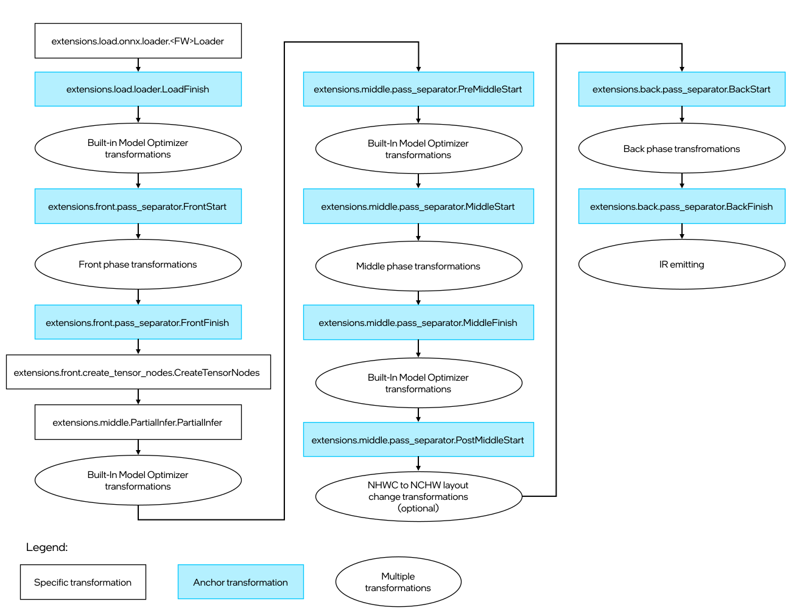

# Model Optimizer Extensions {#openvino_docs_MO_DG_prepare_model_customize_model_optimizer_Model_Optimizer_Extensions}


Model Optimizer extensions enable you to inject some logic to the model conversion pipeline without changing the Model
Optimizer core code. There are three types of the Model Optimizer extensions:

1. Model Optimizer operation.
2. A framework operation extractor.
3. A model transformation, which can be executed during front, middle or back phase of the model conversion.

An extension is just a plain text file with a Python code. The file should contain a class (or classes) inherited from
one of extension base classes. Extension files should be saved to a directory with the following structure:

```sh
./<MY_EXT>/
           ops/                  - custom operations
           front/                - framework independent front transformations
                 <FRAMEWORK_1>/  - front transformations for <FRAMEWORK_1> models only and extractors for <FRAMEWORK_1> operations
                 <FRAMEWORK_2>/  - front transformations for <FRAMEWORK_2> models only and extractors for <FRAMEWORK_2> operations
                 ...
           middle/               - middle transformations
           back/                 - back transformations
```

Model Optimizer uses the same layout internally to keep built-in extensions. The only exception is that the 
`mo/ops/` directory is also used as a source of the Model Optimizer operations due to historical reasons.

> **NOTE**: The name of a root directory with extensions should not be equal to "extensions" because it will result in a
> name conflict with the built-in Model Optimizer extensions.

> **NOTE**: Model Optimizer itself is built by using these extensions, so there is a huge number of examples of their
> usage in the Model Optimizer code.

## Model Optimizer Operation <a name="extension-operation"></a>
Model Optimizer defines a `mo.ops.Op` class (`Op` will be used later in the document to be short), which is a base class
for an operation used in the Model Optimizer. The instance of the `Op` class serves several purposes:

1. Stores the operation attributes.
2. Stores the operation shape/value and type inference functions.
3. Defines operation attributes to be saved to the corresponding IR section.
4. Contains convenient methods to create a graph node from an `Op` object instance and connect it with the existing
graph.
5. Used in the extractors to store parsed attributes and operation specific attributes in the dedicated graph node.

It is important to mention that there is no connection between the instance of the `Op` class and the `Node` object
created from it. The `Op` class is just a container for attributes describing the operation. Model Optimizer uses the `Op`
class during a model conversion to create a node of the graph with attributes copied from the `Op` class instance. Graph
manipulations are performed with graph `Node`s and their attributes and does not involve `Op`s.

There are a number of common attributes used in the operations. Below is the list of these attributes with description.

* `id` — unique identifier of a node in a graph. Generated automatically, equal to the number of nodes in the graph plus
1 if not specified. **Mandatory**.
* `name` — name of the operation. Generated automatically, equal to the `id` if not specified. **Mandatory**.
* `type` — type of the operation according to the [opset specification](@ref openvino_docs_ops_opset). For the internal
Model Optimizer operations, this attribute should be set to `None`. The model conversion fails if an operation with
`type` equal to `None` comes to the IR emitting phase. **Mandatory**.
* `version` — the operation set (opset) name the operation belongs to. If not specified, Model Optimizer sets it
equal to `experimental`. For more information about operation sets, refer to 
[OpenVINO Model Representation](@ref openvino_docs_OV_UG_Model_Representation) section. **Mandatory**.
* `op` — Model Optimizer type of the operation. In many cases, the value of `type` is equal to the value of `op`. However,
when Model Optimizer cannot instantiate the opset operation during model loading, it creates an instance of an internal
operation. Thus, the attribute `op` is used as a type of this internal operation. Later in the pipeline, the node created
from an internal operation will be replaced during front, middle or back phase with node(s) created from the opset.
* `infer` — the attribute defines a function calculating output tensor(s) shape and optional value(s). The attribute
may be set to `None` for the internal Model Optimizer operations used during the front phase only. For more information 
about the shape inference function, refer to the [Partial Inference](#partial-inference) section.
* `type_infer` — the attribute defines a function calculating output tensor(s) data type. If the attribute is not
defined, the default function is used. The function checks if the `data_type` node attribute is set and then
propagates this type to the output tensor from the "port 0". Otherwise, it propagates the data type of the tensor coming
into the input "port 0" to the output tensor from the "port 0".
* `in_ports_count` — default number of input ports to be created for the operation. Additional ports can be created or
redundant ports can be removed using dedicated `Node` class API methods.
* `out_ports_count` — default number of output ports to be created for the operation. Additional ports can be created or
redundant ports can be removed using dedicated `Node` class API methods.

Below is an example of the Model Optimizer class for the [SoftMax](../../../ops/activation/SoftMax_1.md) operation from
the `mo/ops/softmax.py` file with the comments in code.

```py
class Softmax(Op):
    # The class attribute defines a name of the operation so the operation class can be obtained using the
    # "Op.get_op_class_by_name()" static method
    op = 'SoftMax'

    # The operation works as an extractor by default. This is a legacy behavior, currently not recommended for use,
    # thus "enabled" class attribute is set to False. The recommended approach is to use dedicated extractor extension.
    enabled = False

    def __init__(self, graph: Graph, attrs: dict):
        super().__init__(graph, {  # The constructor of the base class Op is called with additional default attributes.
            'type': __class__.op,  # The operation is from the opset so the type is set to 'SoftMax'.
            'op': __class__.op,  # Internal Model Optimizer operation has the same type.
            'version': 'opset1',  # The operation corresponds to opset1.
            'infer': Softmax.infer,  # Shape inference function is defined below.
            'axis': 1,  # Default value for the "axis" attribute of the operation SoftMax.
            'in_ports_count': 1,  # The operation has one input.
            'out_ports_count': 1,  # The operation produces one output.
        }, attrs)

    # The method returns operation specific attributes list. This method is important when implementing
    # extractor inherited from CaffePythonFrontExtractorOp class to extract attribute for Caffe Python operation.
    # However, it is currently used interchangeably with the "backend_attrs()" method. If the "backend_attrs()" is not used,
    # then the "supported_attrs()" is used instead. In this particular case, the operation has just one attribute "axis".
    def supported_attrs(self):
        return ['axis']

    @staticmethod
    def infer(node: Node):
        "some code calculating output shape and values"
```

There is a dedicated method called `backend_attrs()` defining a list of attributes to be saved to the IR. Consider an
example from the `mo/ops/pooling.py` file:
```py
   def backend_attrs(self):
        return [
            ('strides', lambda node: ','.join(map(str, node['stride'][node.spatial_dims]))),
            ('kernel', lambda node: ','.join(map(str, node['window'][node.spatial_dims]))),

            ('pads_begin', lambda node: ','.join(map(str, get_backend_pad(node.pad, node.spatial_dims, 0)))),
            ('pads_end', lambda node: ','.join(map(str, get_backend_pad(node.pad, node.spatial_dims, 1)))),

            ('pool-method', 'pool_method'),
            ('exclude-pad', 'exclude_pad'),

            'rounding_type',
            'auto_pad',
        ]
```

The `backend_attrs()` function returns a list of records. A record can be of one of the following formats:
1. A string defining the attribute to be saved to the IR. If the value of the attribute is `None`, the attribute is
not saved. Examples of this case are `rounding_type` and `auto_pad`.
2. A tuple, where the first element is a string defining the name of the attribute as it will appear in the IR and the
second element is a function to produce the value for this attribute. The function gets an instance of the `Node` as the
only parameter and returns a string with the value to be saved to the IR. Examples of this case are `strides`, `kernel`,
`pads_begin` and `pads_end`.
3. A tuple, where the first element is a string defining the name of the attribute as it will appear in the IR and the
second element is the name of the `Node` attribute to get the value from. Examples of this case are `pool-method` and
`exclude-pad`.

## Operation Extractor <a name="extension-extractor"></a>
Model Optimizer runs specific extractor for each operation in the model during the model loading. For more information about this process, refer to the
[operations-attributes-extracting](#operations-attributes-extracting) section.

There are several types of Model Optimizer extractor extensions:
1. The generic one, which is described in this section.
2. The special extractor for Caffe models with Python layers. This kind of extractor is described in the
[Extending Model Optimizer with Caffe Python Layers](Extending_Model_Optimizer_with_Caffe_Python_Layers.md) guide.

This section is focused on the option #1, which provides a generic mechanism for the operation extractor applicable for
all frameworks. Model Optimizer provides the `mo.front.extractor.FrontExtractorOp` class as a base class to implement the
extractor. It has the `extract` class method, which gets the only parameter `Node`, which corresponds to the graph node to
extract data from. The operation description in the original framework format is stored in the attribute `pb` of the
node. The extractor goal is to parse this attribute and save necessary attributes to the corresponding node of the
graph. Consider the extractor for the `Const` TensorFlow operation (refer to the
`extensions/front/tf/const_ext.py` file):

```py
from openvino.tools.mo.front.extractor import FrontExtractorOp
from openvino.tools.mo.front.tf.extractors.utils import tf_dtype_extractor, tf_tensor_shape, tf_tensor_content
from openvino.tools.mo.ops.const import Const


class ConstExtractor(FrontExtractorOp):
    # The "op" class attribute defines a type of the operation in the framework (in this case it is a TensorFlow), 
    # for which the extractor should be triggered.
    op = 'Const'
    enabled = True  # The flag that indicates that this extractor is enabled.

    @classmethod
    def extract(cls, node):  # The entry point of the extractor.
        # The `node.pb` attribute stores the TensorFlow representation of the operation, which is a Protobuf message of the
        # specific format. In particular, the message contains the attribute called "value" containing the description of
        # the constant. The string "pb.attr["value"].tensor" is just a Python binding for Protobuf message parsing.
        pb_tensor = node.pb.attr["value"].tensor
        # Get the shape of the tensor from the protobuf message, using the helper function "tf_tensor_shape".
        shape = tf_tensor_shape(pb_tensor.tensor_shape)
        # Create a dictionary with necessary attributes.
        attrs = {
            'shape': shape,
            # Get the tensor value, using "tf_tensor_content" helper function.
            'value': tf_tensor_content(pb_tensor.dtype, shape, pb_tensor),
            # Get the tensor data type, using "tf_dtype_extractor" helper function.
            'data_type': tf_dtype_extractor(pb_tensor.dtype),
        }
        # Update the node attributes, using default attributes from the "Const" operation and attributes saved to the
        # "attrs" dictionary.
        Const.update_node_stat(node, attrs)
        return cls.enabled
```

Consider another example with an extractor of the `Constant` ONNX operation (refer to the
`extensions/front/onnx/const_ext.py` file):

```py
from onnx import numpy_helper
from onnx.numpy_helper import to_array

from openvino.tools.mo.front.extractor import FrontExtractorOp
from openvino.tools.mo.front.onnx.extractors.utils import onnx_attr
from openvino.tools.mo.ops.const import Const


class ConstantExtractor(FrontExtractorOp):
    op = 'Constant'
    enabled = True

    @classmethod
    def extract(cls, node):
        # Use "onnx_attr" helper method, which parses the Protobuf representation of the operation saved in the "node".
        # Gets the value of the attribute with name "value" as "TensorProto" type (specified with a keyword "t").
        pb_value = onnx_attr(node, 'value', 't')
        # Use "numpy_helper.to_array()" ONNX helper method to convert "TensorProto" object to a numpy array.
        value = numpy_helper.to_array(pb_value)

        attrs = {
            'data_type': value.dtype,
            'value': value,
        }
        # Update the node attributes, using default attributes from the "Const" operation and attributes saved to the
        # "attrs" dictionary.
        Const.update_node_stat(node, attrs)
        return cls.enabled
```

The extractors for operations from different frameworks work similarly. The only difference is in the helper methods
used to parse operation attributes encoded with a framework-specific representation.

A common practice is to use `update_node_stat()` method of the dedicated `Op` class to update the node attributes. This
method does the following:

1. Sets values for common attributes like `op`, `type`, `infer`, `in_ports_count`, `out_ports_count`, `version` to
values specific to the dedicated operation (`Const` operation in this case).
2. Uses `supported_attrs()` and `backend_attrs()` methods, defined in the `Op` class to update specific node attribute
`IE`. The IR emitter uses the value stored in the `IE` attribute to pre-process attribute values and save them to IR.
3. Optionally sets additional attributes provided to the `update_node_stat()` function as a second parameter. Usually
these attributes are parsed from the particular instance of the operation.

> **NOTE**: Model Optimizer uses numpy arrays to store values and numpy arrays of `np.int64` type to store shapes in the
> graph.

## Graph Transformation Extensions <a name="graph-transformations"></a>
Model Optimizer provides various base classes to implement [Front Phase Transformations](#front-phase-transformations),
[Middle Phase Transformations](#middle-phase-transformations), and [Back Phase Transformations](#back-phase-transformations).
All classes have the following common class attributes and methods:
1. The `enabled` attribute specifies whether the transformation is enabled or not. The value can be changed during runtime
to enable or disable execution of the transformation during a model conversion. Default value is `True`.
2. The `id` attribute specifies a unique transformation string identifier. This transformation identifier can be used to
enable (disable) the transformation by setting environment variable `MO_ENABLED_TRANSFORMS` (`MO_DISABLED_TRANSFORMS`)
with a comma separated list of `id`s. The environment variables override the value of the `enabled` attribute of the
transformation. Instead of using `id` attribute value you can add fully defined class name to `MO_ENABLED_TRANSFORMS`
(`MO_DISABLED_TRANSFORMS`) variable, `extensions.back.NonmalizeToNormalizeL2.NormalizeToNormalizeL2` for example. It is an optional attribute.
3. The `run_not_recursively` attribute specifies whether the transformation should be executed in the sub-graphs, for
example, body of the [TensorIterator](../../../ops/infrastructure/TensorIterator_1.md) and the
[Loop](../../../ops/infrastructure/Loop_5.md). Default value is `True`.
4. The `force_clean_up` attribute specifies whether the graph clean up should be executed after the transformation. The
graph cleanup removes nodes of the graph not reachable from the model inputs. Default value is `False`.
5. The `force_shape_inference` attribute specifies whether the nodes marked with `need_shape_inference` attribute equal to
`True` should be re-inferred after the transformation. Model Optimizer sets this attribute automatically for nodes,
input(s) of which were changed during the transformation, or you can set this attribute manually in the transformation for
the specific nodes. Default value is `False`.
5. Attribute `graph_condition` specifies a list of functions with one parameter -- `Graph` object. The transformation
is executed if and only if all functions return `True`. If the attribute is not set, no check is performed.
1. Method `run_before()` returns a list of transformation classes which this transformation should be executed before.
2. Method `run_after()` returns a list of transformation classes which this transformation should be executed after.

> **NOTE**: Some of the transformation types have specific class attributes and methods, which are explained in the
> corresponding sections of this document.

Model Optimizer builds a graph of dependencies between registered transformations and executes them in the topological
order. To execute the transformation during a proper model conversion phase, Model Optimizer defines several
anchor transformations that do nothing. All transformations are ordered with respect to these anchor transformations.
The diagram below shows anchor transformations, some of built-in transformations and dependencies between them:



User-defined transformations are executed after the corresponding `Start` and before the corresponding `Finish` anchor
transformations by default (if `run_before()` and `run_after()` methods have not been overridden).

> **NOTE**: The `PreMiddleStart` and `PostMiddleStart` anchors were introduced due to historical reasons to refactor
> the Model Optimizer pipeline, which initially had a hardcoded order of transformations.

### Front Phase Transformations <a name="front-phase-transformations"></a>
There are several types of a front phase transformation:

1. [Pattern-Defined Front Phase Transformations](#pattern-defined-front-phase-transformations) triggered for each
sub-graph of the original graph isomorphic to the specified pattern.
2. [Specific Operation Front Phase Transformations](#specific-operation-front-phase-transformations) triggered for the
node with a specific `op` attribute value.
3. [Generic Front Phase Transformations](#generic-front-phase-transformations).
4. Manually enabled transformation, defined with a JSON configuration file (for TensorFlow, ONNX, Apache MXNet, and PaddlePaddle models), specified using the `--transformations_config` command-line parameter:
    1. [Node Name Pattern Front Phase Transformations](#node-name-pattern-front-phase-transformation).
    2. [Front Phase Transformations Using Start and End Points](#start-end-points-front-phase-transformations).
    3. [Generic Front Phase Transformations Enabled with Transformations Configuration File](#generic-transformations-config-front-phase-transformations).

#### Pattern-Defined Front Phase Transformations <a name="pattern-defined-front-phase-transformations"></a>
This type of transformation is implemented using `mo.front.common.replacement.FrontReplacementSubgraph` and
`mo.front.common.replacement.FrontReplacementPattern` as base classes and works as follows:
1. Define a sub-graph to be matched, using a list of nodes with attributes and edges connecting them (edges
may also have attributes).
2. Model Optimizer searches for all sub-graphs of the original graph, isomorphic to the specified sub-graph (pattern).
3. Model Optimizer executes the defined function performing graph transformation for each instance of a
matched sub-graph. You can override different functions in the base transformation class so the Model Optimizer
works differently:
   1. The `replace_sub_graph(self, graph, match)` override the method. In this case Model Optimizer only executes the
   overridden function, pass the `graph` object and a dictionary describing the matched sub-graph. You are
   required to write the transformation and connect the newly created nodes to the rest of the graph.
   2. The `generate_sub_graph(self, graph, match)` override the method. This case is not recommended for use because it is
   the most complicated approach. It can be effectively replaced with one of two previous approaches. 
   The explanation of this function is provided in the 
   [Node Name Defined Sub-Graph Transformations](#node-name-defined-sub-graph-transformations) section.

The sub-graph pattern is defined in the `pattern()` function. This function should return a dictionary with two keys:
`nodes` and `edges`:
* The value for the `nodes` key is a list of tuples with two elements.
   * The first element is an alias name for a node that will be used to define edges between nodes and in the
   transformation function.
   * The second element is a dictionary with attributes. The key is a name of an attribute that should exist in the
   node. The value for the attribute can be some specific value to match or a function that gets a single parameter -
   the attribute value from the node. The function should return the result of attribute comparison with a dedicated
   value.
* The value for the `edges` key is a list of tuples with two or three elements.
   * The first element is the alias name of the node producing a tensor.
   * The second element is the alias name of the node consuming the tensor.
   * The third element (optional) is the dictionary with expected edge attributes. This dictionary usually contains
   attributes like `in` and `out`, defining input and output ports.

Consider the example of a front transformation implemented in the `extensions/front/Mish_fusion.py` file performing
fusing of the sub-graph defining the [Mish](../../../ops/activation/Mish_4.md) activation function into a single
operation:

```py
from openvino.tools.mo.front.Softplus_fusion import SoftplusFusion
from openvino.tools.mo.ops.activation_ops import Mish
from openvino.tools.mo.front.common.replacement import FrontReplacementSubgraph
from openvino.tools.mo.front.subgraph_matcher import SubgraphMatch
from openvino.tools.mo.graph.graph import Graph, rename_nodes


class MishFusion(FrontReplacementSubgraph):
    """
    The transformation looks for the pattern with Softplus defining the Mish function: Mish(x) = x * tanh(SoftPlus(x)).
    """
    enabled = True  # Transformation is enabled.

    def run_after(self):  # Run this transformation after "SoftplusFusion" transformation.
        return [SoftplusFusion]

    def pattern(self):  # Define pattern according to formulae x * tanh(SoftPlus(x)).
        return dict(
            nodes=[
                ('mul', dict(op='Mul')),
                ('tanh', dict(op='Tanh')),
                ('softplus', dict(op='SoftPlus')),
            ],
            edges=[
                ('softplus', 'tanh'),
                ('tanh', 'mul'),
            ])

    def replace_sub_graph(self, graph: Graph, match: [dict, SubgraphMatch]):  # Entry point for the transformation.
        mul = match['mul']  # Get the Node corresponding to matched "mul" node.
        mul_name = mul.soft_get('name', mul.id)
        softplus = match['softplus']  # Get the Node corresponding to the matched "softplus" node.

        # Determine the input port of Mul which gets the 'input' node output.
        input_port_idx = int(mul.in_port(0).get_connection().get_source().node.soft_get('op') == 'Tanh')

        # Check that the same tensor is provided as input to Mul and SoftPlus.
        if mul.in_port(input_port_idx).get_source() != softplus.in_port(0).get_source():
            return

        mish = Mish(graph, {}).create_node()  # Create Mish operation.
        mish.in_port(0).connect(mul.in_port(input_port_idx).get_source())  # Connect input to the Mish.
        mul.out_port(0).get_connection().set_source(mish.out_port(0))  # Reconnect outgoing edge from "mul" to Mish.

        # Rename the created Mish operation to have the name of the "mul" node, which produced the value equal to the
        # Mish output.
        rename_nodes([(mul, mul_name + '/TBR'), (mish, mul_name)])
```

#### Specific Operation Front Phase Transformations <a name="specific-operation-front-phase-transformations"></a>
This type of transformation is implemented using `mo.front.common.replacement.FrontReplacementOp` as base class and
works as follows:
1. Define an operation type to trigger the transformation.
2. Model Optimizer searches for all nodes in the graph with the attribute `op` equal to the specified value.
3. Model Optimizer executes the defined function performing graph transformation for each instance of a matched
node. You can override different functions in the base transformation class and Model Optimizer works
differently:
   1. The `replace_sub_graph(self, graph, match)` override method. In this case, Model Optimizer only executes the overridden
   function. Pass the `graph` object and a dictionary with a single key `op` with the matched node as value. You are
   required to write the transformation and connect the newly created nodes to the rest of the graph.
   2. The `replace_op(self, graph, node)` override method. In this case, Model Optimizer executes the overridden function.
   Pass the `graph` object and the matched node as `node` parameter. If the function returns an `id` of some node, then
   the `Node` with this `id` is connected to the consumers of the matched node. After applying the transformation, the
   matched node is removed from the graph.

The `FrontReplacementOp` class provides a simpler mechanism to match a single operation with specific value of the `op`
(write the `op` attribute in the class instead of defining a `pattern()` function) attribute and perform the
transformation.

Consider an example transformation from the `extensions/front/Pack.py` file, which replaces `Pack` operation from
the TensorFlow:
```py
from openvino.tools.mo.front.common.partial_infer.utils import int64_array
from openvino.tools.mo.front.common.replacement import FrontReplacementOp
from openvino.tools.mo.front.tf.graph_utils import create_op_with_const_inputs
from openvino.tools.mo.graph.graph import Node, Graph, rename_nodes
from openvino.tools.mo.ops.concat import Concat
from openvino.tools.mo.ops.unsqueeze import Unsqueeze


class Pack(FrontReplacementOp):
    op = "Pack"  # Trigger transformation for all nodes in the graph with the op = "Pack" attribute 
    enabled = True  # Transformation is enabled.

    def replace_op(self, graph: Graph, node: Node):  # Entry point for the transformation.
        # Create a Concat operation with a number of inputs equal to a number of inputs to Pack.
        out_node = Concat(graph, {'axis': node.axis, 'in_ports_count': len(node.in_ports())}).create_node()
        pack_name = node.soft_get('name', node.id)

        for ind in node.in_ports():
            # Add dimension of size 1 to all inputs of the Pack operation and add them as Concat inputs.
            unsqueeze_node = create_op_with_const_inputs(graph, Unsqueeze, {1: int64_array([node.axis])},
                                                         {'name': node.soft_get('name', node.id) + '/Unsqueeze'})
            node.in_port(ind).get_connection().set_destination(unsqueeze_node.in_port(0))
            unsqueeze_node.out_port(0).connect(out_node.in_port(ind))

        # Rename the created Concat operation to have the name of the "pack" node, which produced the value equal to the
        # Concat output.
        rename_nodes([(node, pack_name + '/TBR'), (out_node, pack_name)])
        return [out_node.id]  # Reconnect the Pack operation consumers to get input from Concat instead.
```

#### Generic Front Phase Transformations <a name="generic-front-phase-transformations"></a>
Model Optimizer provides a mechanism to implement generic front phase transformation. This type of transformation is
implemented using `mo.front.common.replacement.FrontReplacementSubgraph` or
`mo.front.common.replacement.FrontReplacementPattern` as base classes. Make sure the transformation is enabled before trying to execute it. 
Then, Model Optimizer executes the `find_and_replace_pattern(self, graph)` method and
provides a `Graph` object as an input.

Consider the example of a generic front transformation from the `extensions/front/SqueezeNormalize.py` file performing
normalization of the [Squeeze](../../../ops/shape/Squeeze_1.md) operation. Older version of the operation had a list of
axes to squeeze as an attribute, but now it is a separate input. For backward compatibility, the Model Optimizer
operation supports both semantics. Before IR generation, however, the operation should be normalized according to the
specification.

```py
import logging as log

from openvino.tools.mo.front.common.partial_infer.utils import int64_array
from openvino.tools.mo.front.common.replacement import FrontReplacementPattern
from openvino.tools.mo.graph.graph import Graph
from openvino.tools.mo.ops.const import Const
from openvino.tools.mo.utils.error import Error


class SqueezeNormalize(FrontReplacementPattern):
    """
    Normalizes inputs of the Squeeze layers. The layers should have two inputs: the input with data and input with the
    dimensions to squeeze. If the second input is omitted then all dimensions of size 1 should be removed.
    """
    enabled = True  # The transformation is enabled.

    def find_and_replace_pattern(self, graph: Graph):  # The function is called unconditionally.
        for squeeze_node in graph.get_op_nodes(op='Squeeze'):  # Iterate over all nodes with op='Squeeze'.
            # If the operation has only 1 input node and no 'squeeze_dims' Node attribute, then convert the attribute to
            # the operation input.
            if len(squeeze_node.in_nodes()) == 1 and squeeze_node.has_valid('squeeze_dims'):
                dims_node = Const(graph, {'name': squeeze_node.id + '/Dims',
                                          'value': int64_array(squeeze_node.squeeze_dims)}).create_node()
                squeeze_node.in_port(1).connect(dims_node.out_port(0))
                del squeeze_node['squeeze_dims']
            # If two inputs already exist, that means the operation is already normalized.
            elif len(squeeze_node.in_nodes()) == 2:
                log.debug('The Squeeze node "{}" is already normalized'.format(squeeze_node.name))
            # In all other cases, raise an error.
            else:
                raise Error('The Squeeze layer "{}" should either have 2 inputs or one input and an "squeeze_dims" '
                            'attribute'.format(squeeze_node.soft_get('name')))
```

For the details on implementation and how these front phase transformations work, refer to the `mo/front/common/replacement.py`
file.

#### Node Name Pattern Front Phase Transformations <a name="node-name-pattern-front-phase-transformations"></a>

TensorFlow uses a mechanism of scope to group related operation nodes. It is a good practice to put nodes performing
particular task into the same scope. This approach divides a graph into logical blocks that are easier to review in the
TensorBoard. The scope, in fact, just defines a common name prefix for the nodes belonging to it.

For example, Inception topologies contain several types of so-called "Inception blocks". Some of them are equal to each
other, but located in different places of the network. For example, Inception V4 from the
[TensorFlow-Slim image classification model library](https://github.com/tensorflow/models/tree/master/research/slim) has
`Mixed_5b`, `Mixed_5c` and `Mixed_5d` inception blocks with exactly the same nodes, with the same set of attributes.

Consider a situation when these Inception blocks are implemented extremely efficiently using a single Inference
Engine operation called `InceptionBlock` and these blocks in the model need to be replaced with instances of this operation.
Model Optimizer provides mechanism to trigger the transformation for a sub-graph of operations defined by the node name
regular expressions (scope). In this particular case, some of the patterns are: `.*InceptionV4/Mixed_5b`,
`.*InceptionV4/Mixed_5c`* and `.*InceptionV4/Mixed_5d`. Each pattern starts with `.*`, because the `InceptionV4` prefix 
is added to all nodes names during a model freeze.

This type of transformation is implemented using `mo.front.tf.replacement.FrontReplacementFromConfigFileSubGraph` as a
base class and works as follows:
1. Prepare a JSON configuration file template defining node names patterns.
2. Run Model Optimizer with the `--tensorflow_custom_operations_config_update` command-line parameter, and
Model Optimizer adds information about input and output nodes of the specified sub-graphs.
3. Model Optimizer executes the defined transformation **only** when you specify the path to the
configuration file updated in step 2 using the `--transformations_config` command-line parameter .

Consider the following possible configuration file template for the Inception Block transformation:
```json
[
    {
        "custom_attributes": {
            "attr1_key": "attr1_value",
            "attr2_key": 123456
        },
        "id": "InceptionBlockTransformation",
        "instances": [
            ".*InceptionV4/Mixed_5b",
            ".*InceptionV4/Mixed_5c",
            ".*InceptionV4/Mixed_5d"
        ],
        "match_kind": "scope"
    }
]
```

The configuration file contains a list of dictionaries. Each dictionary defines one transformation. Each transformation
is defined with several parameters:

* `id` (mandatory) - is a unique identifier of the transformation. It is used in the Python code that implements the
transformation to link the class and the transformation description from the configuration file.
* `match_kind` (mandatory) - is a string that specifies the matching algorithm. For the node name pattern case, the value
should be equal to `scope`. Another possible values are described in the dedicated sections below.
* `instances` (mandatory) - specifies instances of the sub-graph to be matched. It contains a list of node names prefixes
patterns for the match kind of the `scope` type.
* `custom_attributes` (optional) - is a dictionary with attributes that can be used in the transformation code.

After running Model Optimizer with additional `--tensorflow_custom_operations_config_update` parameter pointing to
the template configuration file, the content of the file should be updated with two new sections `inputs` and `outputs`.
The file content after the update is as follows:
```json
[
    {
        "id": "InceptionBlockTransformation",
        "custom_attributes": {
            "attr1_key": "attr1_value",
            "attr2_key": 123456
        },
        "instances": [
            ".*InceptionV4/Mixed_5b",
            ".*InceptionV4/Mixed_5c",
            ".*InceptionV4/Mixed_5d"
        ],
        "match_kind": "scope",
        "inputs": [
            [
                {
                    "node": "Branch_2/Conv2d_0a_1x1/Conv2D$",
                    "port": 0
                },
                {
                    "node": "Branch_3/AvgPool_0a_3x3/AvgPool$",
                    "port": 0
                },
                {
                    "node": "Branch_1/Conv2d_0a_1x1/Conv2D$",
                    "port": 0
                },
                {
                    "node": "Branch_0/Conv2d_0a_1x1/Conv2D$",
                    "port": 0
                }
            ]
        ],
        "outputs": [
            {
                "node": "concat$",
                "port": 0
            }
        ]
    }
]
```

The value for `inputs` key is a list of lists describing input tensors of the sub-graph. Each element of the top-level
list corresponds to one unique input tensor of the sub-graph. Each internal list describes a list of nodes consuming
this tensor and port numbers, where the tensor is consumed. Model Optimizer generates regular expressions for the input
nodes names to uniquely identify them in each instance of the sub-graph, defined by the `instances`. Denote these nodes
as input nodes of the sub-graph.

In the InceptionV4 topology, the `InceptionV4/Mixed_5b` block has four input tensors from outside of the sub-graph,
but all of them are produced by the `InceptionV4/Mixed_5a/concat` node. Therefore, the top-level list of the `inputs`
contains one list corresponding to this tensor. Four input nodes of the sub-graph consume the tensor produced by
`InceptionV4/Mixed_5a/concat` node. In this case, all four input nodes consume input tensor into "port 0".

The order of items in the internal list describing nodes does not matter, but the order of elements in the top-level
list is important. This order defines how Model Optimizer attaches input tensors to a new generated
node if the sub-graph is replaced with a single node. The `i`-th input node of the sub-graph is obtained using 
`match.single_input_node(i)` call in the sub-graph transformation code. More information about API is given below. If it is
necessary to change the order of input tensors, the configuration file can be edited in the text editor.

The value for the `outputs` key is a list describing nodes of the sub-graph producing tensor, that goes outside of the
sub-graph or does not have child nodes. Denote these nodes as output nodes of the sub-graph. The order of elements in
the list is important. The `i`-th element of the list describes the `i`-th output tensor of the sub-graph, which could be
obtained using `match.output_node(i)` call. The order of elements can be manually changed in the configuration file.
Model Optimizer uses this order to connect output edges if the sub-graph is replaced with a single node.

For more examples of this type of transformation, refer to the [Converting TensorFlow Object Detection API Models](../convert_model/tf_specific/Convert_Object_Detection_API_Models.md) guide.

#### Front Phase Transformations Using Start and End Points <a name="start-end-points-front-phase-transformations"></a>
This type of transformation is implemented using `mo.front.tf.replacement.FrontReplacementFromConfigFileSubGraph` as a
base class and works as follows:
1. Prepare a JSON configuration file that defines the sub-graph to match, using two lists of node names:
"start" and "end" nodes.
2. Model Optimizer executes the defined transformation **only** when you specify the path to the
configuration file using the `--transformations_config` command-line parameter . Model Optimizer performs the following
steps to match the sub-graph:
   1. Starts a graph traversal from every start node following the direction of the graph edges. The search stops in an
   end node or in the case of a node without consumers. All visited nodes are added to the matched sub-graph.
   2. Starts another graph traversal from each non-start node of the sub-graph, i.e. every node except nodes from the
   "start" list. In this step, the edges are traversed in the opposite edge direction. All newly visited nodes are added
   to the matched sub-graph. This step is needed to add nodes required for calculation values of internal nodes of the
   matched sub-graph.
   3. Checks that all "end" nodes were reached from "start" nodes. If not, it exits with an error.
   4. Checks that there are no [Parameter](../../../ops/infrastructure/Parameter_1.md) operations among added nodes. If
   they exist, the sub-graph depends on the inputs of the model. Such configuration is considered incorrect so 
   Model Optimizer exits with an error.

This algorithm finds all nodes "between" start and end nodes and nodes needed for calculation of non-input nodes of the
matched sub-graph.

The example of a JSON configuration file for a transformation with start and end points is
`extensions/front/tf/ssd_support_api_v1.15.json`:

```json
[
    {
        "custom_attributes": {
            "code_type": "caffe.PriorBoxParameter.CENTER_SIZE",
            "pad_mode": "caffe.ResizeParameter.CONSTANT",
            "resize_mode": "caffe.ResizeParameter.WARP",
            "clip_before_nms": false,
            "clip_after_nms": true
        },
        "id": "ObjectDetectionAPISSDPostprocessorReplacement",
        "include_inputs_to_sub_graph": true,
        "include_outputs_to_sub_graph": true,
        "instances": {
            "end_points": [
                "detection_boxes",
                "detection_scores",
                "num_detections"
            ],
            "start_points": [
                "Postprocessor/Shape",
                "Postprocessor/scale_logits",
                "Postprocessor/Tile",
                "Postprocessor/Reshape_1",
                "Postprocessor/Cast_1"
            ]
        },
        "match_kind": "points"
    }
]
```

The format of the file is similar to the one provided as an example in the
[Node Name Pattern Front Phase Transformations](#node-name-pattern-front-phase-transformations) section. The difference is in
the value of the `match_kind` parameter, which should be equal to the `points` and the format of the `instances` parameter,
which should be a dictionary with two keys `start_points` and `end_points`, defining start and end node names
respectively.

> **NOTE**: The `include_inputs_to_sub_graph` and `include_outputs_to_sub_graph` parameters are redundant and should be
> always equal to `true`.

> **NOTE**: This sub-graph match algorithm has a limitation that each start node must have only one input. Therefore, it
> is not possible to specify, for example, the [Convolution](../../../ops/convolution/Convolution_1.md) node as input
> because it has two inputs: data tensor and tensor with weights.

For other examples of transformations with points, refer to the
[Converting TensorFlow Object Detection API Models](../convert_model/tf_specific/Convert_Object_Detection_API_Models.md) guide.

#### Generic Front Phase Transformations Enabled with Transformations Configuration File <a name="generic-transformations-config-front-phase-transformations"></a>
This type of transformation works similarly to the [Generic Front Phase Transformations](#generic-front-phase-transformations)
but require a JSON configuration file to enable it similarly to
[Node Name Pattern Front Phase Transformations](#node-name-pattern-front-phase-transformation) and
[Front Phase Transformations Using Start and End Points](#start-end-points-front-phase-transformations).

The base class for this type of transformation is
`mo.front.common.replacement.FrontReplacementFromConfigFileGeneral`. Model Optimizer executes the 
`transform_graph(self, graph, replacement_descriptions)` method and provides the `Graph` object and dictionary with values
parsed from the `custom_attributes` attribute of the provided JSON configuration file.

The example of the configuration file for this type of transformation is `extensions/front/tf/yolo_v1_tiny.json`:

```json
[
  {
    "id": "TFYOLO",
    "match_kind": "general",
    "custom_attributes": {
      "classes": 20,
      "coords": 4,
      "num": 2,
      "do_softmax": 0
    }
  }
]
```
and the corresponding transformation file is `./extensions/front/YOLO.py`:

```py
from openvino.tools.mo.front.no_op_eraser import NoOpEraser
from openvino.tools.mo.front.standalone_const_eraser import StandaloneConstEraser
from openvino.tools.mo.ops.regionyolo import RegionYoloOp
from openvino.tools.mo.front.tf.replacement import FrontReplacementFromConfigFileGeneral
from openvino.tools.mo.graph.graph import Node, Graph
from openvino.tools.mo.ops.result import Result
from openvino.tools.mo.utils.error import Error


class YoloRegionAddon(FrontReplacementFromConfigFileGeneral):
    """
    Replaces all Result nodes in graph with YoloRegion->Result nodes chain.
    YoloRegion node attributes are taken from configuration file
    """
    replacement_id = 'TFYOLO'  # The identifier matching the "id" attribute in the JSON file.

    def run_after(self):
        return [NoOpEraser, StandaloneConstEraser]

    def transform_graph(self, graph: Graph, replacement_descriptions):
        op_outputs = [n for n, d in graph.nodes(data=True) if 'op' in d and d['op'] == 'Result']
        for op_output in op_outputs:
            last_node = Node(graph, op_output).in_node(0)
            op_params = dict(name=last_node.id + '/YoloRegion', axis=1, end_axis=-1)
            op_params.update(replacement_descriptions)
            region_layer = RegionYoloOp(graph, op_params)
            region_layer_node = region_layer.create_node([last_node])
            # In here, 'axis' from 'dim_attrs' can be removed to avoid permutation from axis = 1 to axis = 2.
            region_layer_node.dim_attrs.remove('axis')
            Result(graph).create_node([region_layer_node])
            graph.remove_node(op_output)
```

The configuration file has only 3 parameters: `id` identifier of the transformation , `match_kind` (which should be equal
to `general`) and the `custom_attributes` dictionary with custom attributes accessible in the transformation.

### Middle Phase Transformations <a name="middle-phase-transformations"></a>
There are two types of middle phase transformations:

1. [Pattern-Defined Middle Phase Transformations](#pattern-defined-middle-phase-transformations) triggered for each
sub-graph of the original graph, isomorphic to the specified pattern.
2. [Generic Middle Phase Transformations](#generic-middle-phase-transformations).

#### Pattern-Defined Middle Phase Transformations <a name="pattern-defined-middle-phase-transformations"></a>
This type of transformation is implemented using `mo.middle.replacement.MiddleReplacementPattern` as a base class and
works similarly to the [Pattern-Defined Front Phase Transformations](#pattern-defined-middle-phase-transformations).
The are two differences:
1. The transformation entry function name is `replace_pattern(self, graph, match)`.
2. The pattern defining the graph should contain data nodes because the structure of the graph is different between
front and middle phases. For more information about the
graph structure changes, refer to the [Partial Inference](#partial-inference) section.

For the example of a pattern-defined middle transformation, refer to the `extensions/middle/L2NormToNorm.py` file.

#### Generic Middle Phase Transformations <a name="generic-middle-phase-transformations"></a>
Model Optimizer provides a mechanism to implement generic middle phase transformations. This type of transformation is
implemented using `mo.middle.replacement.MiddleReplacementPattern` as a base class and works similarly to the
[Generic Front Phase Transformations](#generic-front-phase-transformations). The only difference is that the
transformation entry function name is `find_and_replace_pattern(self, graph: Graph)`.

For the example of this transformation, refer to the `extensions/middle/CheckForCycle.py` file.

### Back Phase Transformations <a name="back-phase-transformations"></a>
There are two types of back phase transformations:

1. [Pattern-Defined Back Phase Transformations](#pattern-defined-back-phase-transformations) triggered for each
sub-graph of the original graph, isomorphic to the specified pattern.
2. [Generic Back Phase Transformations](#generic-back-phase-transformations).

> **NOTE**: The graph layout during the back phase is always NCHW. However, during the front and middle phases it could
> be NHWC if the original model was using it. For more details, refer to [Model Conversion Pipeline](#model-conversion-pipeline) section.

#### Pattern-Defined Back Phase Transformations <a name="pattern-defined-back-phase-transformations"></a>
This type of transformation is implemented using `mo.back.replacement.MiddleReplacementPattern` as a base class and
works the same way as [Pattern-Defined Front Phase Transformations](#pattern-defined-middle-phase-transformations).

For the example of a pattern-defined back transformation, refer to the `extensions/back/ShufflenetReLUReorder.py` file.

#### Generic Back Phase Transformations <a name="generic-back-phase-transformations"></a>
Model Optimizer provides mechanism to implement generic back phase transformations. This type of transformation is
implemented using `mo.back.replacement.BackReplacementPattern` as a base class and works the same way as
[Generic Middle Phase Transformations](#generic-middle-phase-transformations).

For the example of this transformation, refer to the `extensions/back/GatherNormalizer.py` file.